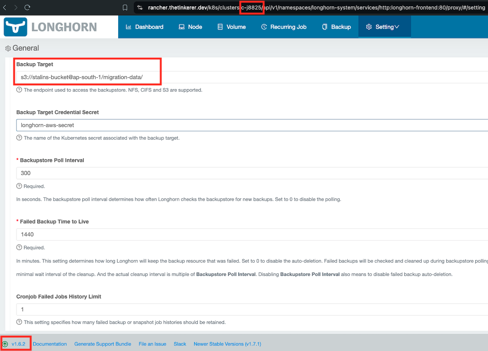
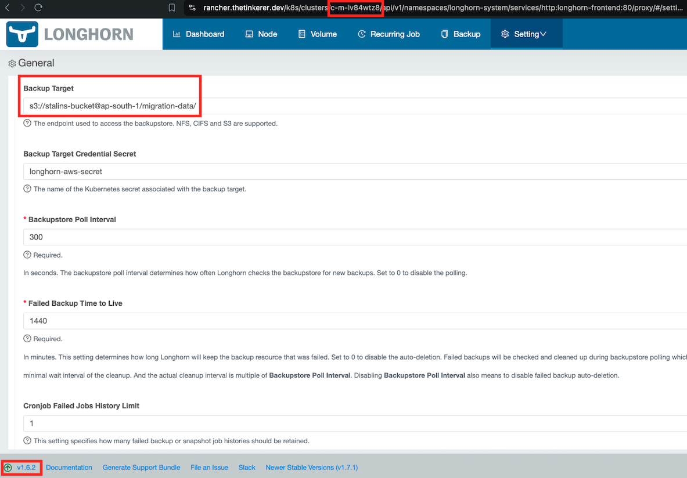

# Table of Content:

- [Introduction](#introduction-1)
- [Setup](#setup)
- [Migration](#migration)
- [Troubleshooting](#troubleshooting)
- [FAQ](#faq)


# Introduction

### **What is the tool's purpose?**

The primary goal of `cattle-drive` tool is to migrate certain objects from source downstream RKE1 cluster to target RKE2 downstream cluster. These objects include:

   - Projects
        - Namespaces
        - ProjectRoleTemplateBindings
   - ClusterRoleTemplateBindings
   - Cluster Apps
   - Cluster Catalog Repos

### **How does the tool contribute to achieving its goals?**

The tool needs to interact with Rancher to obtain the resources of the source RKE1 downstream cluster such that it can migrate the required resources to the downstream RKE2 cluster. 

To communicate Rancher, you would need to download the `KUBECONFIG` file from the UI of the local cluster. If you are using the kubeconfig file of the upstream RKE1, RKE2 or k3s cluster, you would need to give it admin access by creating a `no-scoped` token using this [doc](https://ranchermanager.docs.rancher.com/api/quickstart) and update the kubeconfig file with the token. 

### **How to gain access to this tool?**

You can download this tool from the [releases](https://github.com/rancherlabs/cattle-drive/releases) page.

# Setup

### Pre-requisites:

   - Both the source and destination clusters must be running the same minor version of Kubernetes (e.g. migrating from an RKE1 cluster running `v1.26.9-rancher1-1` to an RKE2 cluster running `v1.26.14+rke2r1`).
   - Both the source and destination clusters must be running the same version of Longhorn. This pre-requiste is needed for workload migration from one cluter to another. 
   - Both clusters must have the same [Backup Target configured in Longhorn](https://longhorn.io/docs/1.7.1/snapshots-and-backups/backup-and-restore/set-backup-target/).


### **Source Cluster:**

| RKE1 Version | Longhorn Version | Cluster Name | Cluster ID | Longhorn Backup Target                           |
| ------------ | ---------------- | ------------ | ---------- | ------------------------------------------------ |
| `v1.28.3`    | `v1.6.2`         | `source-rke` | `c-j8825`  | `s3://stalins-bucket@ap-south-1/migration-data/` |




### **Destination Cluster:**

|   RKE2 Version  | Longhorn Version | Cluster Name  |   Cluster ID   | Longhorn Backup Target                           |
| --------------- | ---------------- | ------------- | -------------- | ------------------------------------------------ |
| `v1.28.3+rke2r1`| `v1.6.2`         | `target-rke2` | `c-m-lv84wtz8` | `s3://stalins-bucket@ap-south-1/migration-data/` |



---

### **Bastion Host:**

This can be any host from where you would run `cattle-drive` tool to connect to the Rancher upstream cluster to perform migration. 

   - ### Download the `cattle-drive` tool

      ```bash
      stalin@bastion:~/cattle-drive$ curl -L  https://github.com/rancherlabs/cattle-drive/releases/download/v0.1.2/cattle-drive_Linux_x86_64.tar.gz | tar -zxvf -
        % Total    % Received % Xferd  Average Speed   Time    Time     Time  Current
                                       Dload  Upload   Total   Spent    Left  Speed
        0     0    0     0    0     0      0      0 --:--:-- --:--:-- --:--:--     0
        0 12.7M    0     0    0     0      0      0 --:--:--  0:00:01 --:--:--     0
      LICENSE
      README.md
      cattle-drive
      100 12.7M  100 12.7M    0     0  4327k      0  0:00:03  0:00:03 --:--:-- 8976k
      ```

   - ### `KUBECONFIG` file of Rancher.
      - Download the kubeconfig file of the local cluster from the Rancher UI. If you are using the upstream clusters kubeconfig file, then you would have to follow the procedure mentioned [here](#how-does-the-tool-contribute-to-achieving-its-goals).

     > Location of kubeconfig files in upstream clusters:
      - RKE1 - kubeconfig file named `kube_config_cluster.yml` is generated automatically in the same directory from where you ran the `rke up` command.
      - RKE2 - `/etc/rancher/rke2/rke2.yaml`.
      - K3S - `/etc/rancher/k3s/k3s.yaml`.

   - ### Test `cattle-drive` connectivity.
      - Once you have the **kubeconfig** file and **cattle-drive** tool ready, you can execute the below command to test if the tool is able to communicate with Rancher and fetch details about the status of the objects to migrate from source RKE1 cluster to target RKE2 cluster. 

      ```bash
      stalin@bastion:~/cattle-drive$ export KUBECONFIG=<Path_To_Kubeconfig_file>
      stalin@bastion:~/cattle-drive$ ./cattle-drive status -s source-rke -t target-rke2 --kubeconfig ~/cattle-drive/upstream-kubeconfig 
      Project status:
      - [demo-project] ✘
       -> namespaces:
              - [database] ✘
              - [demo-ns1] ✘
              - [demo-ns2] ✘
              - [demo-ns3] ✘
      Cluster users permissions:
      Catalog repos:
      ```
      - As you can see from the above output, the connection was successful and the tool returns a status displaying the resources that are marked as `✘` which denotes that they are yet to be migrated to the target cluster. 

# Migration

### Migrate Rancher objects: 
Let's try to migrate the Rancher objects from  `source-rke` cluster to `target-rke2` cluster. The tool contains two more commands:

- `migrate` - This command is used for migrating all the resources in one single shot. 

   ```bash
   stalin@bastion:~/cattle-drive$ ./cattle-drive migrate -s source-rke -t target-rke2 --kubeconfig ~/cattle-drive/upstream-kubeconfig 
   Migrating Objects from cluster [source-rke] to cluster [target-rke2]:
   - migrating Project [demo-project]... Done.
     - migrating Namespace [database]... Done.
     - migrating Namespace [demo-ns1]... Done.
     - migrating Namespace [demo-ns2]... Done.
     - migrating Namespace [demo-ns3]... Done.


   stalin@bastion:~/cattle-drive$ ./cattle-drive status -s source-rke -t target-rke2   --kubeconfig ~/cattle-drive/upstream-kubeconfig 
   Project status:
    - [demo-project] ✔
     -> namespaces:
            - [database] ✔
            - [demo-ns1] ✔
            - [demo-ns2] ✔
            - [demo-ns3] ✔
   Cluster users permissions:
   Catalog repos:
   ```

   - You can see that the `migrate` command does not give you a selective option to migrate resources. 
   - When re-running the `status` command you can see `✔` at the end of each resource which denotes that it was successfully migrated.
   
      
   

- `interactive` - This command is useful for selective migration.
   ```bash
   # You can see few namespaces not migrated. We will `demo-ns5` and `demo-ns7` to the target cluster using interactive method.

   stalin@bastion:~/cattle-drive$ ./cattle-drive status -s source-rke -t target-rke2 --kubeconfig ~/cattle-drive/upstream-kubeconfig 
   Project status:
    - [demo-project] ✔
     -> namespaces:
            - [database] ✔
            - [demo-ns1] ✔
            - [demo-ns2] ✔
            - [demo-ns3] ✔
            - [demo-ns4] ✘
            - [demo-ns5] ✘
            - [demo-ns7] ✘
            - [demo-ns8] ✘
   Cluster users permissions:
   Catalog repos:
   ```
   [](https://asciinema.org/a/DcXn5zk23O2nzY2qNCim4KFM2)

   - You can use the `m` key stroke within the interactive shell to migrate a specific resource of choice. 

### Migrate Workload:

Now that we have migrated the Rancher resources like project and associated namespaces to the target cluster, let's migrate a workload deployed in the `database` namespace of the `source-rke` cluster to the `target-rke2` cluster. 

You can use the below YAML manifest to deploy a `MySQL DB` app on the source cluster.

   ```YAML
   apiVersion: apps/v1
   kind: StatefulSet
   metadata:
    name: mysql
    namespace: database
   spec:
    selector:
      matchLabels:
        app: mysql
    serviceName: mysql
    replicas: 1
    template:
      metadata:
        labels:
          app: mysql
      spec:
        terminationGracePeriodSeconds: 10
        containers:
        - name: mysql
          image: mysql:8
          ports:
          - containerPort: 3306
            name: mysql
          env:
          - name: MYSQL_ROOT_PASSWORD
            value: "testing1234"
          - name: MYSQL_DATABASE
            value: "test"
          volumeMounts:
          - mountPath: /var/lib/mysql
            name: mysql-vol
    volumeClaimTemplates:
    - metadata:
        name: mysql-vol
      spec:
        storageClassName: longhorn
        accessModes: [ "ReadWriteOnce" ]
        resources:
          requests:
            storage: 1Gi
   ```

> **BACKUP - Start with Longhorn Volume Backup of MySQL app to S3 on the `source-rke` cluster.**

The migration of the workload is started by scaling down the running workload (to prevent further writes to the volume), and creating a backup of the volume.

- Scale down the running workload in the source clusters.
   ```bash
   kubectl -n database scale statefulset mysql --replicas=0
   ```
- In the Rancher UI explore the source cluster, click on **Longhorn** in the left-hand resource menu, and then click the **Longhorn** link to open the Longhorn UI.
- Click on **Volumes** within the Longhorn UI, locate the volume for the mysql-0 Pod of the mysql StatefulSet (the volume should be in a Detached state, since the StatefulSet was scaled down to 0 replicas) and click on it to open the volume details UI.
- Click on the volume menu dropdown in the top-right and click **Attach** to attach the volume to a node within the cluster (the volume must be in an attached state in order to take a backup).
- Click **Create Backup** and then **OK** to create a backup of the volume. Depending upon the volume size and network bandwidth, the backup creation may take some time.
- You can check the Backup status by navigating to **Backup** within the Longhorn UI, then locating and clicking on the volume for the mysql-0 Pod of the mysql StatefulSet, to open the list of backups for the volume. To continue with the migration the Creation State of the backup needs to be **Completed**.

   ```bash
   kubectl get lhb -A
   ```

> **RESTORE - Restore the Longhorn Volume of MySQL app from S3 in the `target-rke2` cluster**

The migration is completed in the destination cluster, by restoring the Longhorn volume from backup, recreating the PVC from Longhorn, and finally deploying the workload.

- In the Rancher UI explore the destination cluster, click on **Longhorn** in the left-hand resource menu, and then click the **Longhorn** link to open the Longhorn UI.
- Navigate to **Backup** within the Longhorn UI, then locate and click on the volume for the mysql-0 Pod of the mysql StatefulSet, to open the list of backups for the volume. (**N.B.** The default Backup Poll Interval in Longhorn is 300 seconds, in this RKE2 lab environment it is set to 60 seconds, so you may have to wait up to one minute for the volume backup created above in the RKE cluster to be visible in the RKE2 cluster).
- Locate the most recent backup created on the source cluster per the steps above, and on the **Operation** dropdown menu click on **Restore**.
- Select checkbox **Use Previous Name** in the restore options (for this lab exercise it is also necessary to reduce the **Number of Replicas** to 1), and then click **OK**.  Depending upon the volume size and network bandwidth, the backup creation may take some time.
- Click on **Volumes** within the Longhorn UI, locate the volume for the mysql-0 Pod of the mysql StatefulSet and click on it to open the volume details UI. 
- Once the restore operation is complete the volume should be in a **Detached** state and **Ready** for workload.
- Click on the volume menu dropdown in the top-right and click **Create PV/PVC** to create the PV and PVC in the destination cluster.
- Ensure **Create PVC** and **Use Previous PVC** are selected, and then click **OK**.
- Explore the destination cluster within the Rancher UI and confirm that both the PVC and PVC are present and Bound.
- Deploy the mysql StatefulSet workload into the destination cluster, per the manifest above.


# Troubleshooting

# FAQ


